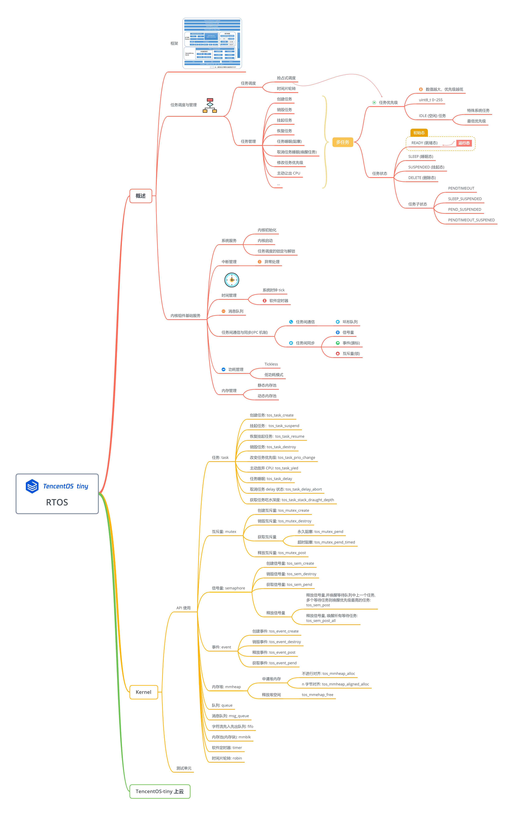

# LearningTencentOS-tiny

TencentOS-tiny 在 ALIENTEK@STM32L4 开发板上运行的学习笔记 &amp;&amp; 示例工程
> based on ALIENTEK@STM32L4 Pandora Developement Board V2.51, TencentOS-tiny

---

## TencentOS-tiny 概述

[官方 Repositories](https://github.com/Tencent/TencentOS-tiny)

TencentOS tiny 整体架构

## TencentOS-tiny 移植 && 内核 API 使用

### 移植 TencentOS-tiny 到 ALIENTEK@STM32L4 潘多拉开发板

### TencentOS-tiny 内核 API 使用

## TencentOS-tiny 上云
